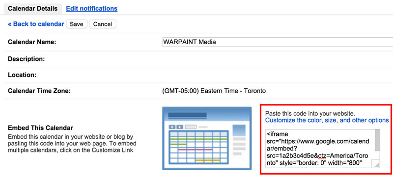

# Custom Google Calendar

Apply a custom stylesheet to an embedded Google Calendar to match the rest of your site.

This fork assumes a server initiated pull rather than relying on page loads by shifting the embedded PHP code to a Python3 script intended to be run at regular intervals.

## Instructions
Since you can't just inject a stylesheet into an iframe or overwrite the CSS we have to go at it a different way...

1. Find the link to your calendar

If you are the owner of the calendar, this can be found in your calendar details:


2. Download the calendar each time the script is ran

```python
r = requests.get("https://www.google.com/calendar/embed?...")
```

3. Split the downloaded HTML right before `</head>` and add your stylesheet

```python
page = r.text.replace('</head>', '<link rel="stylesheet" href="../calendar/calendar.css"></head>')
```

4. Change a script reference

```python
page = page.replace('src="/calendar/','src="https://calendar.google.com/calendar/')
```


4. Save the updated file

```python
with open("./calendar/calendar.html", 'w') as f:
    f.write(page)

```
_Make sure you have write permissions on the folder you are saving to_

5. Render the saved file in an iframe

```html
<iframe src="calendar/calendar.html" frameborder="0" height="750"></iframe>
```

_Make sure a height is specified on the iframe or you won't see any events_

6. Theme away! Now you can style the calendar to match the rest of your site. There is an SCSS file included with some variables that might speed things up.

